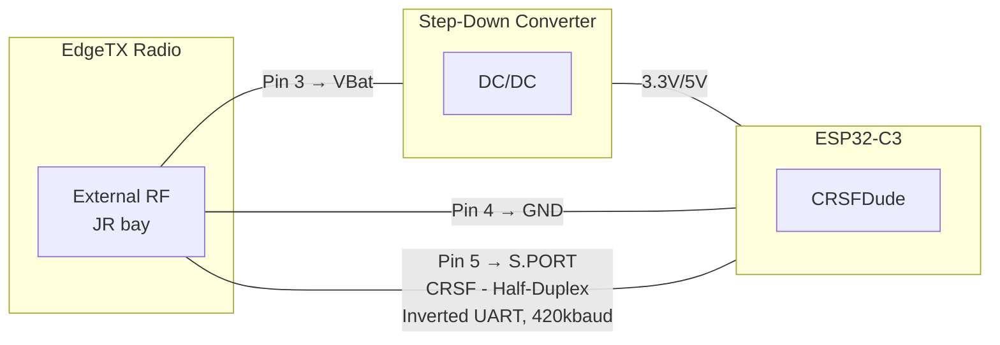

# CRSFDude

An Arduino/PlatformIO library for building CRSF external modules on ESP32-C3. Handles half-duplex inverted UART, RC channel decoding, telemetry TX, and the EdgeTX handshake — so you can focus on your application.

## Features

- Single-wire half-duplex CRSF on GPIO 20 (inverted signal, 420kbaud)
- Decodes all 16 RC channels (packed 11-bit)
- Sends telemetry back to EdgeTX (flight mode, battery, etc.)
- Handles EdgeTX Device Ping/Info handshake automatically
- Installable as PlatformIO library dependency

### Why another CRSF library?

Existing libraries are built for the **receiver side** — reading channels from an ELRS/Crossfire RX. Acting as a **TX module in the JR bay** requires features none of them support:

| Feature | [CRSFforArduino](https://github.com/ZZ-Cat/CRSFforArduino) | [AlfredoCRSF](https://github.com/AlfredoSystems/AlfredoCRSF) | [ESP_CRSF](https://github.com/DamianK77/ESP_CRSF) | **CRSFDude** |
|---------|:---:|:---:|:---:|:---:|
| Read RC channels | yes | yes | yes | yes |
| Send telemetry | yes | - | partial | yes |
| Half-duplex single pin | - | - | - | yes |
| Inverted signal (JR bay) | - | - | - | yes |
| EdgeTX Device Ping handshake | - | - | - | yes |
| Link Stats (enables streaming) | - | - | - | yes |
| ESP32-C3 support | untested | untested | ESP-IDF only | yes |
| Framework | Arduino | Arduino | ESP-IDF | Arduino |
| License | AGPL-3.0 | GPL-3.0 | - | MIT |

The hard parts — half-duplex GPIO matrix switching, inverted signal handling, the [undocumented EdgeTX handshake](https://github.com/EdgeTX/edgetx/blob/main/radio/src/telemetry/crossfire.cpp), and the link stats requirement for sensor discovery — are the 80% of the problem. Building telemetry frames is the easy part. `CRSFDude` fills this gap.

## Hardware

Only three JR bay pins are needed (Pin 1 and Pin 2 are unused):

- **Radio:** EdgeTX-compatible with external RF (JR bay)
- **Board:** ESP32-C3 DevKit (others to be tested)
- **Pin 3 (VBat):** Radio battery voltage — needs a step-down converter (buck/LDO) to 3.3V for the ESP32-C3
- **Pin 4 (GND):** Ground
- **Pin 5 (S.PORT):** CRSF half-duplex, inverted UART, 420kbaud, 8N1



## Installation

Add to your `platformio.ini`:

```ini
lib_deps = https://github.com/rngtng/CRSFDude.git
```

## Quick Start

```cpp
#include "CRSFDude.h"

CRSFDude crsf;

void setup() {
    crsf.begin(20, 420000);  // pin, baud
}

void loop() {
    if (crsf.update()) {
        uint16_t ch1 = crsf.getChannel(0);  // 0-2047
        crsf.sendLinkStats(90, 90, 100, 10, 0, 4, 3, 80, 100, 8);
        crsf.sendFlightMode("ACRO");
    }
}
```

### API

| Method | Description |
|--------|-------------|
| `begin(pin, baud)` | Initialize half-duplex UART |
| `update()` | Parse incoming frames, returns `true` on new RC data |
| `getChannel(ch)` | Read channel value (0-15, 11-bit, 0-2047) |
| `sendLinkStats(...)` | Link statistics — **must send to enable other sensors** |
| `sendFlightMode(mode)` | Flight mode string (shows in EdgeTX top bar) |
| `sendBattery(V, A, mAh, %)` | Battery voltage (0.1V), current (0.1A), capacity, remaining |
| `sendGPS(lat, lon, spd, hdg, alt, sats)` | GPS: degrees*1e7, cm/s, deg*100, meters, count |
| `sendAttitude(pitch, roll, yaw)` | Attitude in radians*10000 |
| `sendBaroAltitude(cm)` | Barometric altitude in centimeters |
| `sendVario(cm/s)` | Vertical speed in cm/s |
| `sendDeviceInfo(name)` | Device info (auto-called on Device Ping) |
| `sendFrame(buf, len)` | Send raw CRSF frame |
| `modelId` | Active model ID (0-63), set by radio on model switch |
| `onModelIdChanged` | Callback fired when radio switches model |
| `onDevicePing` | Callback for Device Ping (default: auto-responds) |

### EdgeTX Sensor Names

These are the sensor names that appear in EdgeTX after discovery:

| Method | EdgeTX Sensors | Unit |
|--------|----------------|------|
| `sendLinkStats(...)` | 1RSS, 2RSS, RQly, RSNR, ANT, RFMD, TPWR, TRSS, TQly, TSNR | dB, %, mW |
| `sendFlightMode()` | FM | text |
| `sendBattery()` | RxBt, Curr, Capa, Bat% | V, A, mAh, % |
| `sendGPS()` | GPS, GSpd, Hdg, GAlt, Sats | deg, km/h, deg, m, count |
| `sendAttitude()` | Ptch, Roll, Yaw | rad |
| `sendBaroAltitude()` | Alt | m |
| `sendVario()` | VSpd | m/s |

## Development

```bash
pio test -e native              # run tests (no device needed)
pio run -e esp32c3 -t upload    # build & flash example
pio device monitor              # serial monitor
```

Example output:

```
CRSFDude starting...
CH1:  992  CH2: 1024  CH3:  998  CH4:  992  [rx:150 tx:30 /s]
```

## Limitations / Known Issues

- **ESP32-C3 only** — GPIO matrix behavior differs on original ESP32 and S3; untested on those
- **One telemetry frame per TX window** — sending multiple frames back-to-back causes collisions with the radio's next RC packet; rotate sensor types across cycles
- **UART1 hardcoded** — works for ESP32-C3 (UART0 is USB), but limits flexibility on other boards
- **No LUA script support** — radio can't configure the module from its UI (REQUEST_SETTINGS not implemented)
- **No channel-to-PWM output** — library decodes channels but doesn't drive servos/ESCs

See [TODO.md](TODO.md) for planned improvements.

## Further Reading

- [Blog Post](https://www.rngtng.com/CRSFDude/BLOGPOST) — the full story: inverted signals, half-duplex hell, frozen radios, and the undocumented EdgeTX handshake
- [Retro](https://www.rngtng.com/CRSFDude/RETRO) — what went well, what didn't, lessons learned
