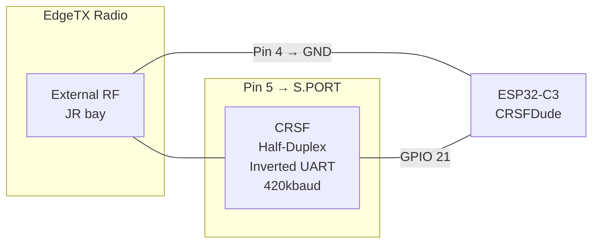

# CRSFDude

ESP32-C3 firmware that acts as a CRSF external module in a JR bay. Reads RC channels from the radio over half-duplex inverted UART and sends telemetry back.

## Architecture



## Features

- Single-wire half-duplex CRSF on GPIO 20 (inverted signal, 420kbaud)
- Decodes all 16 RC channels (packed 11-bit)
- Sends telemetry back to EdgeTX (flight mode, battery, etc.)
- Handles EdgeTX Device Ping/Info handshake automatically
- Includes reusable `CRSFDude` library under `lib/`

## Why another CRSF library?

Existing libraries are built for the **receiver side** — reading channels from an ELRS/Crossfire RX. Acting as a **TX module in the JR bay** requires features none of them support:

| Feature | [CRSFforArduino](https://github.com/ZZ-Cat/CRSFforArduino) | [AlfredoCRSF](https://github.com/AlfredoSystems/AlfredoCRSF) | [ESP_CRSF](https://github.com/DamianK77/ESP_CRSF) | **CRSFDude** |
|---------|:---:|:---:|:---:|:---:|
| Read RC channels | yes | yes | yes | yes |
| Send telemetry | yes | - | partial | yes |
| Half-duplex single pin | - | - | - | yes |
| Inverted signal (JR bay) | - | - | - | yes |
| EdgeTX Device Ping handshake | - | - | - | yes |
| Link Stats (enables streaming) | - | - | - | yes |
| ESP32-C3 support | untested | untested | ESP-IDF only | yes |
| Framework | Arduino | Arduino | ESP-IDF | Arduino |
| License | AGPL-3.0 | GPL-3.0 | - | MIT |

The hard parts — half-duplex GPIO matrix switching, inverted signal handling, the [undocumented EdgeTX handshake](https://github.com/EdgeTX/edgetx/blob/main/radio/src/telemetry/crossfire.cpp), and the link stats requirement for sensor discovery — are the 80% of the problem. Building telemetry frames is the easy part. `CRSFDude` fills this gap.

## Hardware

- **Board:** ESP32-C3 DevKit
- **CRSF Pin:** GPIO 20 — connects to JR bay S.PORT (signal pin)
- **Signal:** Inverted UART, idle LOW, 420000 baud, 8N1

## Build & Flash

```bash
pio run -e esp32c3 -t upload
```

## Monitor

```bash
pio device monitor
```

Output:
```
CRSFDude starting...
CH1:  992  CH2: 1024  CH3:  998  CH4:  992  [rx:150 tx:30 /s]
```

## CRSFDude Library

Reusable library in `lib/CRSFDude/`. Handles all protocol internals:

```cpp
#include "CRSFDude.h"

CRSFDude crsf;

void setup() {
    crsf.begin(20, 420000);  // pin, baud
}

void loop() {
    if (crsf.update()) {
        uint16_t ch1 = crsf.getChannel(0);  // 0-2047
        crsf.sendLinkStats(90, 90, 100, 10, 0, 4, 3, 80, 100, 8);
        crsf.sendFlightMode("ACRO");
    }
}
```

### API

| Method | Description |
|--------|-------------|
| `begin(pin, baud)` | Initialize half-duplex UART |
| `update()` | Parse incoming frames, returns `true` on new RC data |
| `getChannel(ch)` | Read channel value (0-15, 11-bit, 0-2047) |
| `sendLinkStats(...)` | Link statistics — **must send to enable other sensors** |
| `sendFlightMode(mode)` | Flight mode string (shows in EdgeTX top bar) |
| `sendBattery(V, A, mAh, %)` | Battery voltage (0.1V), current (0.1A), capacity, remaining |
| `sendGPS(lat, lon, spd, hdg, alt, sats)` | GPS: degrees*1e7, cm/s, deg*100, meters, count |
| `sendAttitude(pitch, roll, yaw)` | Attitude in radians*10000 |
| `sendBaroAltitude(cm)` | Barometric altitude in centimeters |
| `sendVario(cm/s)` | Vertical speed in cm/s |
| `sendDeviceInfo(name)` | Device info (auto-called on Device Ping) |
| `sendFrame(buf, len)` | Send raw CRSF frame |

## Key Learnings

1. **Signal is inverted** on JR bay S.PORT — EdgeTX radios have a hardware inverter IC
2. **GPIO matrix** handles inversion and half-duplex pin switching on ESP32-C3 (no `uart_set_line_inverse`)
3. **`gpio_reset_pin()` required** on ESP32-C3 to fully release the TX output after sending
4. **EdgeTX handshake** is mandatory — radio sends Device Ping (0x28) after detecting telemetry; must respond with Device Info (0x29) or radio freezes permanently
5. **Link stats required for sensor discovery** — EdgeTX silently drops all telemetry (except flight mode) unless Link Statistics (0x14) with non-zero RxQuality has been received
